<div align="center">

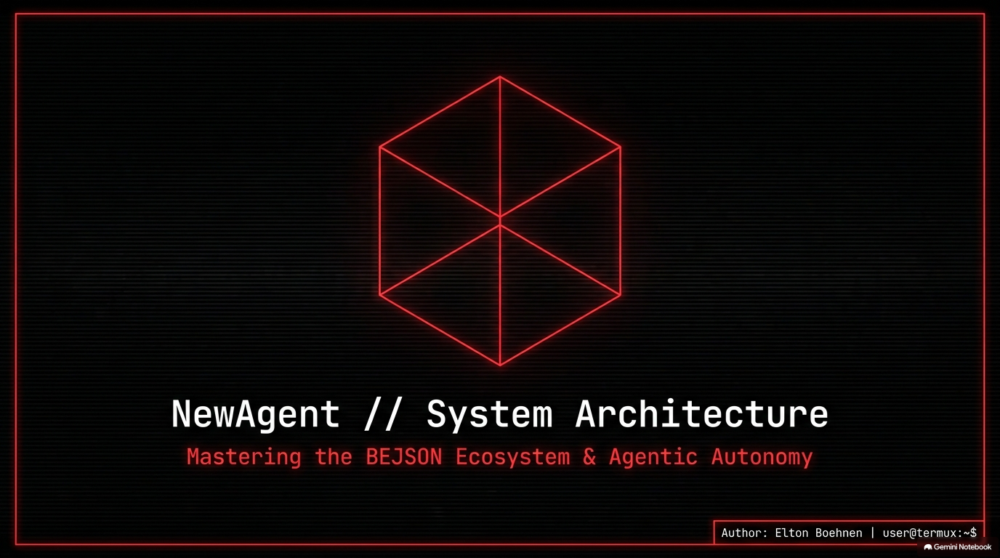

# NewAgent

**v3.20.2 · pkg074** — A ground-up async AI agent terminal client built on the BEJSON ecosystem.<br>
Mastering agentic autonomy through strict data formatting, multi-provider LLM execution, and zero-bloat context engineering.

[](https://python.org)
[](https://github.com/boehnenelton)
[](LICENSE)
[](CHANGELOG)

</div>

---

## Overview

NewAgent is a fully async, modular AI agent framework designed from scratch for Termux/Android and Linux. It is built around three core beliefs:

1. **Data discipline** — All persistent state is stored in BEJSON 104a schemas, never ad-hoc JSON, never flat text.
2. **Engine duality** — A REST engine and a native tool-calling Interactions engine coexist, switching dynamically per task.
3. **Context is engineering** — The prompt window is a managed, budgeted resource rebuilt from scratch every turn — not a naive append buffer.

The result is an agent that stays coherent over long sessions, never wastes tokens, and can be steered precisely through its slash command interface or driven autonomously via structured job schemas.

---

## Architecture Overview

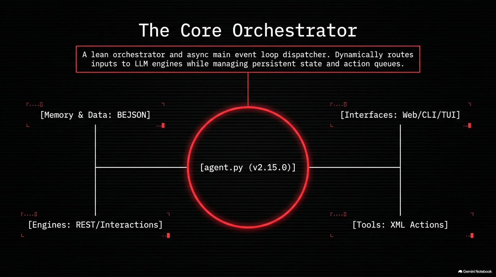

`agent.py` is the lean async event loop at the centre of everything. It receives user input, dispatches to the active LLM engine, processes action tags from the model response, and manages all persistent state. It does not contain business logic — it delegates everything to the library family via clean, importable modules.

**Four quadrants feed into the orchestrator:**

| Quadrant | Contents |
|---|---|
| **Memory & Data** | All state stored as BEJSON 104a — config, sessions, jobs, keys, context |
| **Interfaces** | TUI terminal, Flask web terminal, non-interactive CLI |
| **Engines** | REST (`RestPrompter`) and Interactions (native tool-calling) |
| **Tools** | XML action tag dispatcher — `<exec>`, `<write>`, `<read>`, and more |

---

## The Interface Trinity

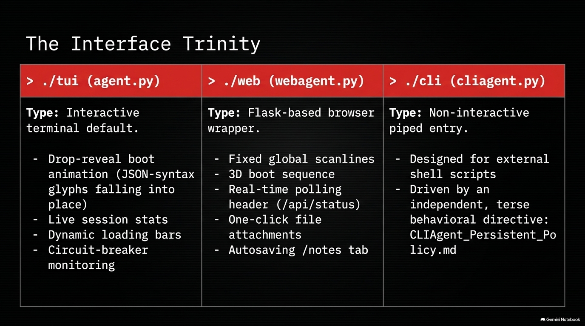

NewAgent ships three distinct runtime surfaces, each sharing the same underlying engine and config stack:

### `agent.py` — Interactive TUI
The primary interface. A rich async terminal session with:
- **Drop-reveal boot animation** — JSON-syntax glyphs fall into place on startup
- **Live session stats** — turn count, token estimates, active engine indicator
- **Dynamic loading bars** — visual feedback during model inference
- **Circuit-breaker monitoring** — surfaced inline; no silent failures
- **Full slash command suite** — `/amnesia`, `/rebirth`, `/compress`, `/jobstart`, `/jobstop`, `/keys`, `/model`, `/engine`, `/snippets`, `/hooks`, and more

```bash
python3 agent.py
```

### `webagent.py` — Flask Web Terminal
A browser-based terminal GUI that shares the same `RestPrompter`, `KeyRegistry`, and `ModelRegistry` as the TUI:
- **3D boot sequence** in the browser on first load
- **Real-time 400ms polling header** — live Model, Engine, Turns, Execs counters
- **CRT scanline overlay** — global `linear-gradient` enforcing the aesthetic
- **One-click file attachments** — drag-and-drop into the chat input
- **Autosaving `/notes` tab** — persistent scratch space across sessions
- **AMNESIA + REBIRTH** split-button header controls
- **Settings panel** — keys, model, engine config editable in-browser

```bash
python3 webagent.py
# → http://localhost:5000
```

### `cliagent.py` — Non-Interactive CLI Runner
Driven by an independent `CLIAgent_Persistent_Policy.md` directive. Designed for shell scripts and automation pipelines:
- Accepts `--prompt`, `--engine`, `--model`, `--max-turns` flags
- Reads from stdin when `--prompt` is omitted
- Outputs clean text or structured BEJSON to stdout
- No TUI chrome — zero interactive dependencies

```bash
python3 cliagent.py --prompt "Summarise this file" --engine rest
echo "What is 2+2?" | python3 cliagent.py --engine rest
```

---

## WebAgent Aesthetic & UX

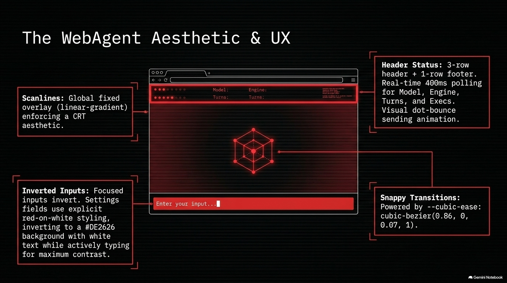

The web terminal is built to a precise visual specification:

- **Palette:** `#000000` background · `#FFFFFF` text · `#DE2626` accent (active states, hover, focus borders)
- **Scanlines:** Fixed global `linear-gradient` overlay that enforces the CRT aesthetic across the entire viewport
- **Header:** 3-row status bar + 1-row footer. Polls `/api/status` every 400ms for Model, Engine, Turns, Execs. Visual dot-bounce animation while the model is generating.
- **Inverted inputs:** Focused inputs flip to `#DE2626` background with white text — maximum contrast, zero ambiguity about focus state.
- **Snappy transitions:** All UI motion uses `cubic-bezier(0.86, 0, 0.07, 1)` — aggressive ease-in-out for a mechanical, intentional feel.
- **Fonts:** `Inter` for UI copy · `Source Code Pro` for all monospace/code elements

---

## The BEJSON Data Foundation

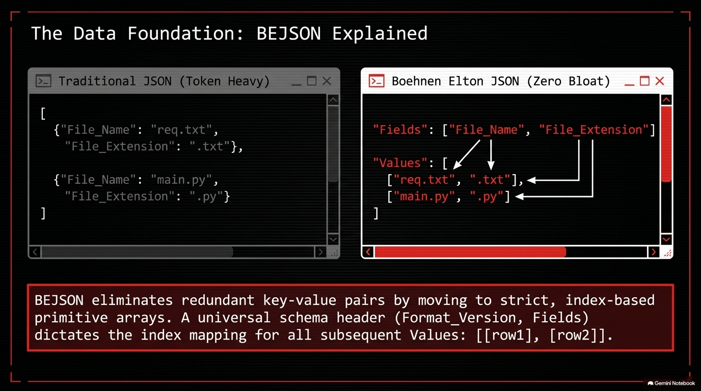

**BEJSON** (Boehnen Elton JSON) is the custom data format that governs every persistent file in NewAgent. It eliminates the token bloat of traditional JSON by separating schema from data:

```json
{
  "Format": "BEJSON",
  "Format_Version": "104a",
  "Fields": ["key_name", "value", "description"],
  "Values": [
    ["log_level", "INFO", "Default logging verbosity"],
    ["max_turns",  50,    "Max turns before auto-compress"]
  ]
}
```

vs. equivalent traditional JSON:
```json
[
  {"key_name": "log_level", "value": "INFO", "description": "Default logging verbosity"},
  {"key_name": "max_turns",  "value": 50,    "description": "Max turns before auto-compress"}
]
```

The field map is declared once. All rows are bare arrays. Every record lookup goes through the **Field Map Cache** — no index-based positional guessing anywhere in the codebase.

### BEJSON Standards Taxonomy

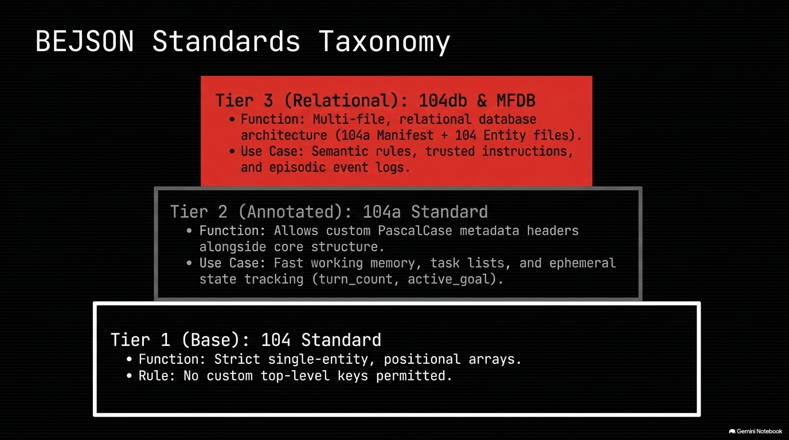

Three tiers serve three distinct roles inside NewAgent:

| Tier | Standard | Purpose |
|---|---|---|
| **1** | `104` Base | Strict single-entity positional arrays. No custom top-level keys. Config, key state, model registry. |
| **2** | `104a` Annotated | Adds PascalCase metadata headers (`Project_Name`, `Session_Id`, etc.) alongside core structure. Fast working memory, task lists, job schemas. |
| **3** | `104db` + MFDB | Multi-file relational architecture — a `104a` manifest pointing to individual `104` entity files. Semantic rules, trusted instructions, episodic event logs. |

All BEJSON I/O goes through `lib_bejson_Core_bejson_core.py` and `lib_bejson_Core_bejson_validator.py`. The validator enforces structural integrity at every read and write — malformed schemas are rejected at the boundary, never silently corrupted.

---

## Memory Engineering

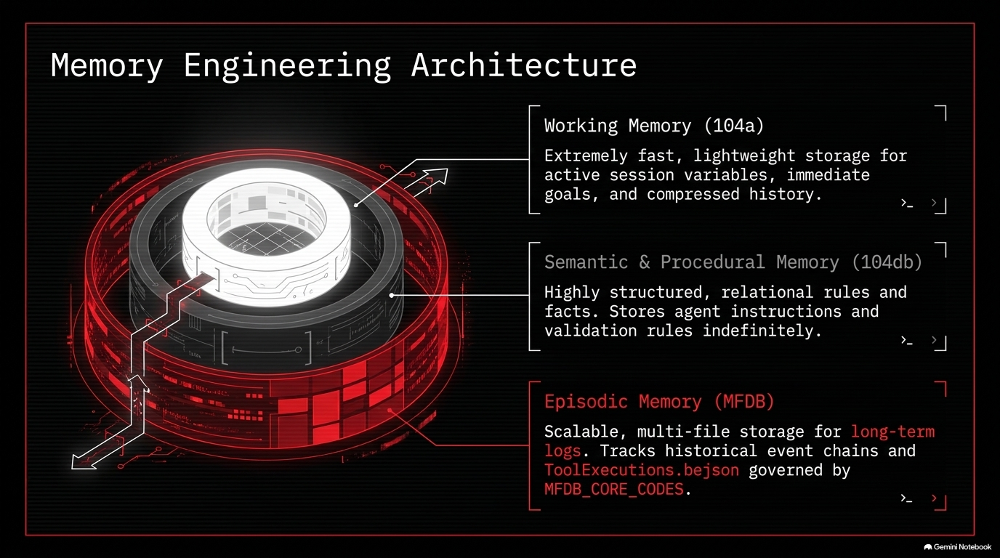

NewAgent implements a three-tier memory architecture mapped directly to BEJSON storage formats:

### Working Memory — `104a`
Extremely fast, lightweight storage for the active session. Holds:
- Active session variables (`turn_count`, `active_goal`, `active_engine`)
- Immediate goals and current job context
- Compressed history recap after `/amnesia`
- Context window budget allocations

### Semantic & Procedural Memory — `104db`
Highly structured, relational rules and facts that persist across all sessions:
- Agent identity and standing behavioural rules (`Context/Persistent_Policy.md`)
- Knowledge pool entries (`config/knowledge_pool.bejson`)
- Validation rules and trusted instructions
- Situational awareness documents (`Context/Situational_Awareness/`)

### Episodic Memory — `MFDB`
Scalable multi-file storage for the long-term event log:
- Per-session BEJSON transcripts (`logs/sessions/`)
- Tool execution histories (`ToolExecutions.bejson`)
- Backup records (`backups/backup_log.bejson`)
- Governed by `MFDB_CORE_CODES` — each record has a typed event code

---

## Context Engineering: The Bubble

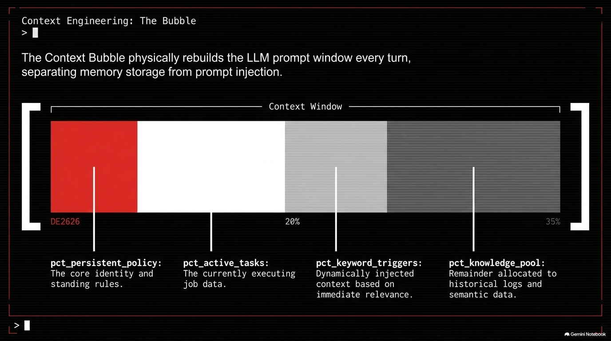

The **Context Bubble** is the core of NewAgent's prompt management. Instead of naively appending every message to a growing history array, the bubble **physically rebuilds the LLM prompt window from scratch every turn** by assembling four budgeted segments:

```
[ Context Window ]
├── pct_persistent_policy  ←  Identity, standing rules (always present, #DE2626 priority)
├── pct_active_tasks       ←  Currently executing job data (injected while a job is live)
├── pct_keyword_triggers   ←  Dynamically injected on keyword match (cooldown-controlled)
└── pct_knowledge_pool     ←  Remainder — historical logs and semantic data
```

This separation means:
- **Persistent Policy** is never crowded out by conversation history
- **Active job context** is always immediately available to the model during execution
- **Keyword triggers** inject targeted knowledge only when relevant — never all the time
- **Knowledge pool** fills the remainder without ever causing an overflow

### Keyword Trigger System

Triggers are configured in `config/triggers.bejson`. Each trigger row specifies a keyword (substring match, case-insensitive), a target knowledge pool entry (`kb://...`), and a cooldown in seconds. On every turn, the bubble scans the user message against all triggers and injects matching entries.

**Built-in trigger sets:**

| Keyword | Entries Injected | Cooldown |
|---|---|---|
| `html` | 12 BEHTML spec entries (Ry=32px law, X0–X7 columns, BEHTML grid system, tri-color palette, raycasting engine, anti-drift auditor) | 600s |
| `book writer` | 6 Cli_Bookwriter workflow entries | 900s |

---

## Multi-Provider REST Engine

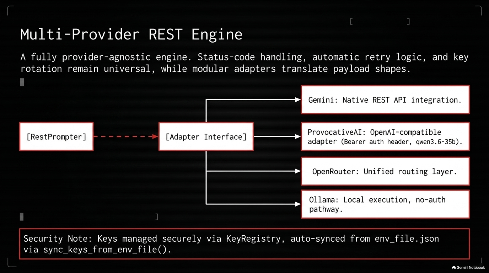

`lib_bejson_newagent_engine_rest.py` implements a fully provider-agnostic REST prompter. The `RestPrompter` class uses an **Adapter Interface** — provider-specific payload shaping is isolated per adapter while all cross-cutting concerns (status-code handling, automatic retry, key rotation) remain universal.

### Supported Providers

| Provider | Adapter | Notes |
|---|---|---|
| **Gemini** | Native | Default. `generateContent` REST endpoint. Streaming and non-streaming. |
| **ProvocativeAI** | OpenAI-compatible | Bearer auth header, `qwen3.6-35b` default. |
| **OpenRouter** | Unified router | Single endpoint, multi-model. `OPENROUTER_MODEL` env var. |
| **Ollama** | Local execution | No-auth pathway. Fully offline capable. |

### Key Management

Keys are stored in `config/keys.bejson` (BEJSON 104a, gitignored) and managed through the `KeyRegistry`:
- **Up to 20 key slots** across all providers
- **Round-robin rotation** — each query uses the next available key in sequence
- **Automatic backoff** — failed keys are marked unavailable with a timestamp and skipped until the cooldown expires
- **`sync_keys_from_env_file()`** — on startup, pulls keys from the system environment files into the registry automatically
- **Web Keys tab** — keys can be loaded, viewed (masked), and rotated directly in the browser UI

### Supported Model IDs (Combo Box)

```
gemini-2.5-flash  ·  gemini-2.5-pro  ·  gemini-3.1-pro-preview
gemini-3-flash-preview  ·  gemini-3.1-flash-lite-preview
gemma-4-31b-it  ·  gemma-4-26b-a4b-it
```

---

## The Job System

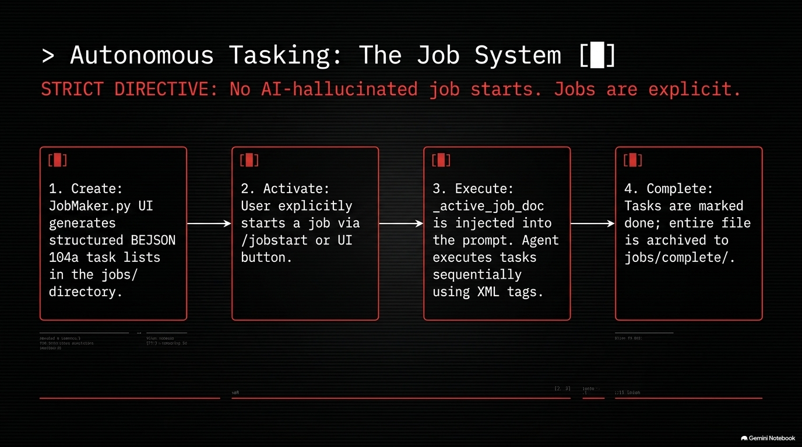

The Job System enables autonomous, multi-step task execution driven by structured BEJSON 104a task lists.

> **STRICT DIRECTIVE:** No AI-hallucinated job starts. Jobs are always explicitly user-initiated.

### Job Lifecycle

```
1. CREATE         2. ACTIVATE          3. EXECUTE           4. COMPLETE
──────────────    ──────────────────   ──────────────────   ──────────────
JobMaker.py UI    /jobstart <name>     _active_job_doc      Tasks marked done
generates         or web UI button     injected into        Job archived to
104a task lists   — user explicit,     prompt each turn.    jobs/complete/
in jobs/          no AI guessing.      XML tags execute      (auto-pruned
                                       sequentially.         after 7 days)
```

### JobMaker.py

`JobMaker.py` is a standalone BEJSON job schema builder. It generates properly structured `104a` task lists in `jobs/` with fields:

```
task_id · task_name · task_description · status · priority · dependencies · notes
```

### Slash Commands

| Command | Action |
|---|---|
| `/jobstart <name>` | Load a job from `jobs/` and begin injecting it into the context bubble |
| `/jobstop` | Deactivate the current job without archiving |
| `/jobs` | List all pending jobs in `jobs/` |

### Auto-pruning

Completed jobs in `jobs/complete/` are automatically pruned after 7 days at each startup via `jobs.cleanup_old_completed_jobs()`. The `jobs/` and `jobs/complete/` directories are created at bootstrap if missing.

---

## Cognitive Maintenance: Amnesia & Rebirth

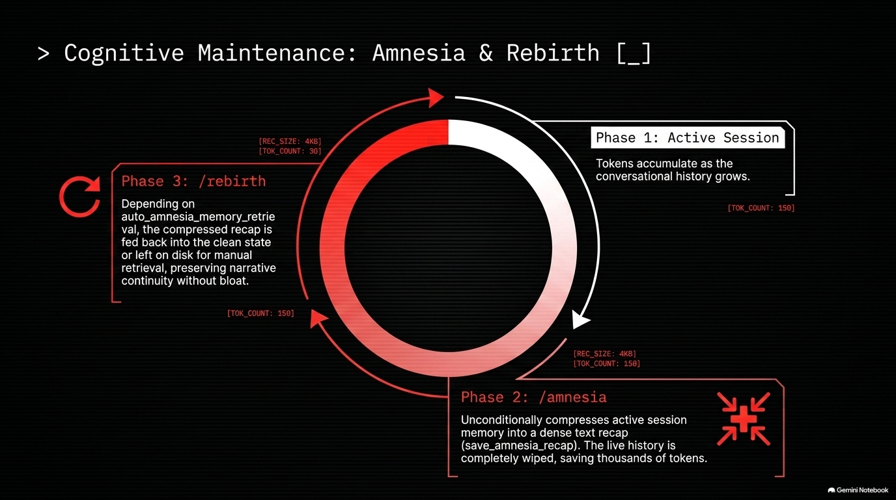

As conversation history grows, token counts balloon and model performance degrades. NewAgent solves this with a two-command **cognitive maintenance** cycle:

### Phase 1 — Active Session
Tokens accumulate turn by turn as the conversational history grows. The bubble manages the window, but raw history still grows linearly.

### Phase 2 — `/amnesia`
The model is asked to generate a dense, compressed recap of everything that has happened. Then:
- The full live history array is **completely wiped** — saving thousands of tokens immediately
- The recap is persisted to `Context/amnesia_recap.txt`
- If `auto_amnesia_memory_retrieval` is `True` in config, the recap is immediately re-seeded as a synthetic "prior context" message — the model wakes up fresh but remembers everything

### Phase 3 — `/rebirth`
If auto-retrieval was off, `/rebirth` manually loads `amnesia_recap.txt` and calls `seed_history_with_recap()` — restoring narrative continuity on demand without any token overhead from the original history.

**Web terminal:** The header exposes this as two buttons — **AMNESIA** and **REBIRTH** — wired to `POST /api/amnesia` and `POST /api/rebirth` respectively.

### `/compress`
A lighter-weight alternative — compresses history in-place without wiping it. Useful mid-session without a full cognitive reset. The underlying compression call runs via `asyncio.to_thread` so it never stalls the main event loop.

---

## The Tooling Ecosystem

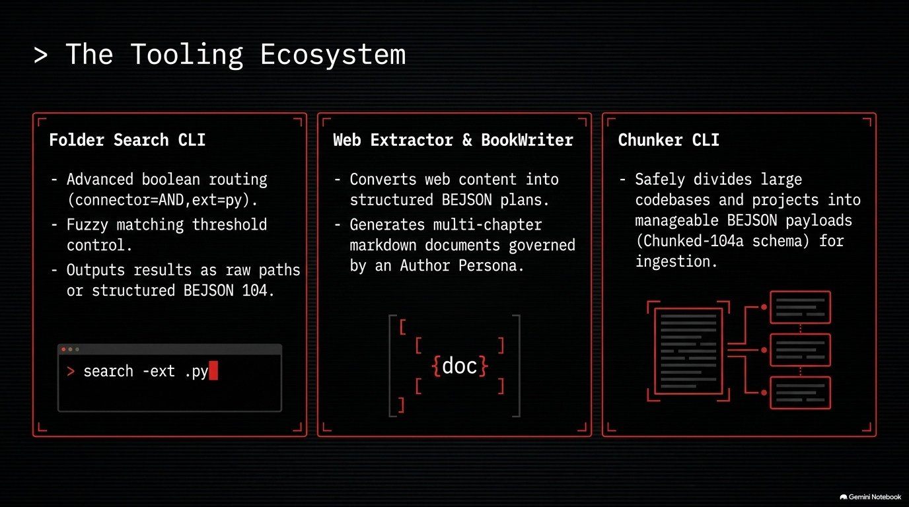

NewAgent ships a suite of standalone CLI tools in `tools/` that the Interactions engine can invoke as sub-processes via `<exec>` action tags:

### Folder Search CLI — `tools/folder_search/Folder_Search.py`
A filesystem search tool with boolean routing:
- Advanced `connector=AND` / `connector=OR` multi-criteria queries
- Extension filtering (`-ext .py`, `-ext .bejson`)
- Fuzzy matching threshold control for approximate filename matching
- Output as raw filesystem paths or structured **BEJSON 104** records for direct ingestion

```bash
python3 tools/folder_search/Folder_Search.py -ext .py -connector AND
```

### Web Extractor — `tools/Cli_Web_Extractor/Cli_Web_Extractor.py`
Converts web content into structured, LLM-ready payloads:
- Fetches and strips HTML → clean markdown
- Outputs structured BEJSON plans suitable for direct job schema injection
- Auto-loads API keys from the system env file chain

### BookWriter — `tools/bookwriter/Cli_Bookwriter.py`
A multi-chapter autonomous writing assistant:
- Generates multi-chapter markdown documents governed by a configurable **Author Persona**
- Plans are stored as structured BEJSON schemas (`data/plans/`)
- Context tracking via `data/context/context_tracking.104a.bejson`
- **Crash-resumable** — re-run picks up from the last completed chapter
- Full Gemini key rotation via its own `KeyRegistry` instance
- Triggered from the main agent via the `book writer` context bubble keyword

```bash
python3 tools/bookwriter/Cli_Bookwriter.py --title "My Book" --chapters 10
```

### Chunker CLI — `tools/chunker/CLI_Chunker.py`
Safely divides large codebases and projects into manageable BEJSON payloads:
- Splits large files into `Chunked-104a` schema records
- Respects token budgets per chunk
- Designed for ingestion pipelines — output is directly consumable by the agent's context bubble

### Whisper CLI — `tools/whisper/`
A Flask-based local speech-to-text endpoint:
- `whisper_cli.py` — command-line transcription
- `app.py` — lightweight HTTP API for real-time voice input to the agent

### Markdown → HTML Converter — `tools/md_to_html/`
Converts agent-generated markdown documents to styled HTML:
- Configured via `md-to-html.config.json`
- Applies the BEHTML tri-color palette and Ry=32px quantization grid automatically

---

## Advanced Frontiers: Evolutionary Logic

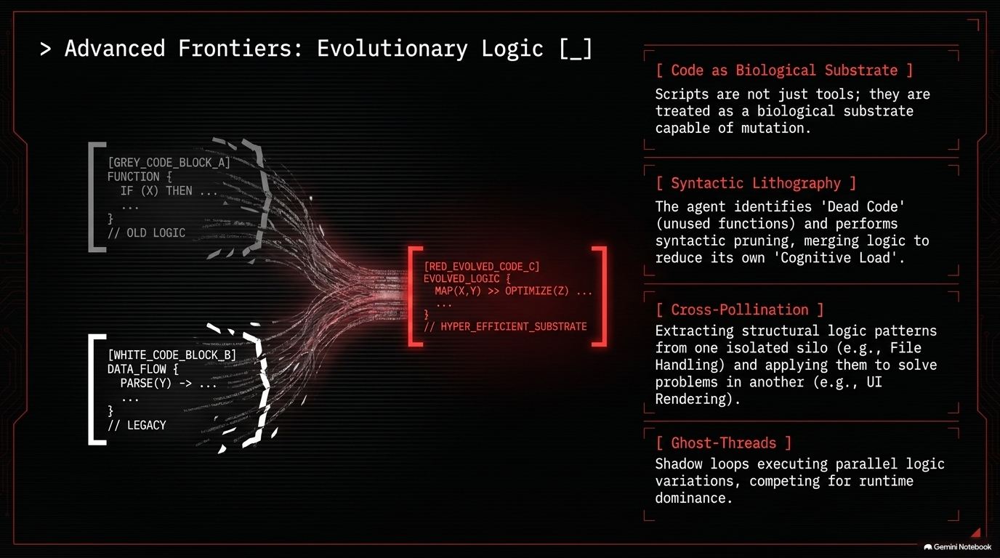

NewAgent's design philosophy extends to a set of advanced architectural concepts for self-improving agentic systems:

### Code as Biological Substrate
Scripts are not static tools — they are treated as a biological substrate capable of mutation. The agent can read, analyse, and propose targeted modifications to its own tool scripts in response to runtime failures or changed requirements.

### Syntactic Lithography
The agent identifies **Dead Code** (unused functions and unreachable branches) and performs **syntactic pruning** — merging logic to reduce its own Cognitive Load. Dead code is logged to `docs/dead_code.md` before removal; the change is recorded in the project changelog.

### Cross-Pollination
Structural logic patterns extracted from one isolated silo (e.g., file chunking in the Chunker CLI) are applied to solve analogous problems in another (e.g., context window assembly in the bubble engine). The agent reasons about architectural analogues across tool boundaries.

### Ghost-Threads *(Research Concept)*
Shadow loops executing parallel logic variations, competing for runtime dominance. A theoretical extension of the dual-engine architecture where multiple prompt strategies execute concurrently and the best response wins.

---

## The NewAgent Flywheel

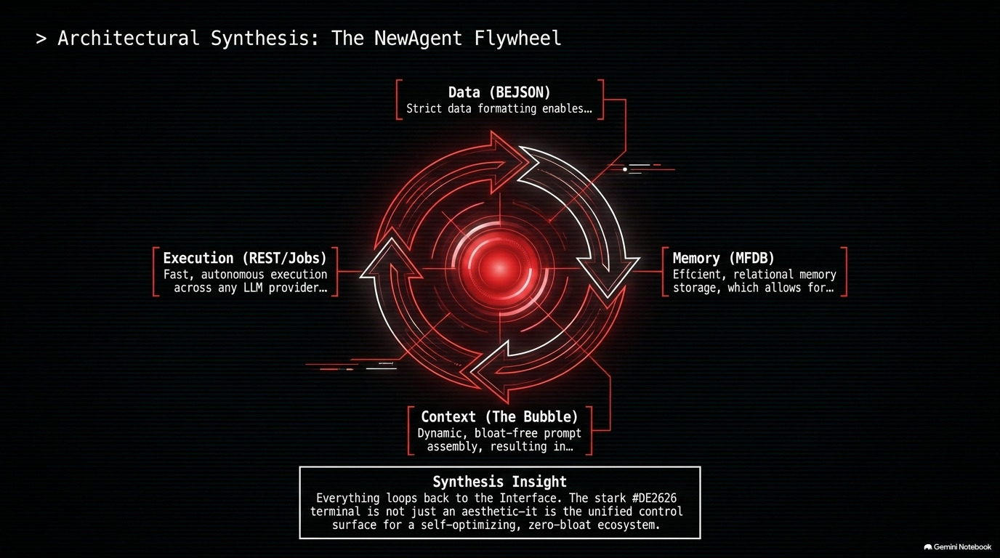

The four pillars of NewAgent form a self-reinforcing loop:

```
        ┌─────────────────────────────────────────┐
        │         Data (BEJSON)                   │
        │  Strict schema discipline enables...    │
        └──────────────────┬──────────────────────┘
                           │
     ┌─────────────────────▼─────────────────────┐
     │        Memory (MFDB)                      │
     │  Efficient relational storage allows...   │
     └──────────────────┬────────────────────────┘
                        │
     ┌──────────────────▼────────────────────────┐
     │        Context (The Bubble)               │
     │  Dynamic, bloat-free prompt assembly      │
     │  resulting in...                          │
     └──────────────────┬────────────────────────┘
                        │
     ┌──────────────────▼────────────────────────┐
     │        Execution (REST/Jobs)              │
     │  Fast, autonomous execution across any   │
     │  LLM provider, which feeds back into...  │
     └─────────────────────────────────────────-─┘
```

> **Synthesis Insight:** Everything loops back to the Interface. The stark `#DE2626` terminal is not just an aesthetic — it is the unified control surface for a self-optimising, zero-bloat ecosystem.

---

## Project Structure

```
NewAgent/
├── agent.py                    # Main async TUI orchestrator (v2.15.0)
├── cliagent.py                 # Non-interactive CLI runner (v1.2.0)
├── webagent.py                 # Flask web terminal (v0.11.0)
├── JobMaker.py                 # BEJSON 104a job schema builder
├── requirements.txt
│
├── config/
│   ├── config.json             # Runtime config (auto-generated on first run)
│   ├── constant_config.bejson  # Immutable constants
│   ├── gemini_catalog.bejson   # Model registry
│   ├── hooks.bejson            # Hook definitions
│   ├── knowledge_pool.bejson   # Context bubble knowledge entries
│   ├── models.bejson           # Active model list
│   ├── snippets.bejson         # Reusable prompt snippets
│   ├── triggers.bejson         # Keyword→knowledge_pool trigger map
│   └── key_state.bejson        # Key availability state (gitignored secrets)
│
├── Context/
│   ├── Context_Bubble.md           # Bubble assembly rules
│   ├── Persistent_Policy.md        # Agent identity & standing rules
│   └── Situational_Awareness/      # Project tracker, checklist, report tools
│
├── jobs/                       # Active BEJSON 104a job schemas
│   └── complete/               # Archived completed jobs (pruned after 7 days)
│
├── lib/
│   ├── lib_bejson_Core_bejson_core.py        # Core BEJSON read/write/cache
│   ├── lib_bejson_Core_bejson_validator.py   # Schema validation
│   ├── lib_bejson_Core_bejson_env.py         # Env file loader
│   ├── lib_bejson_Core_bejson_errors.py      # Error taxonomy
│   ├── lib_bejson_Core_bejson_path_guard.py  # Path safety
│   ├── lib_bejson_Core_mfdb_core.py          # MFDB multi-file database
│   ├── lib_bejson_Core_mfdb_validator.py     # MFDB schema validation
│   ├── lib_bejson_newagent_actions.py        # XML action tag dispatcher
│   ├── lib_bejson_newagent_backup.py         # Session backup manager
│   ├── lib_bejson_newagent_commands.py       # Slash command handlers
│   ├── lib_bejson_newagent_config.py         # Config load/save
│   ├── lib_bejson_newagent_context_bubble.py # Bubble assembly engine
│   ├── lib_bejson_newagent_engine_rest.py    # REST prompter + adapters
│   ├── lib_bejson_newagent_engine_interactions.py  # Native tool-call engine
│   ├── lib_bejson_newagent_errors.py         # Agent error handling
│   ├── lib_bejson_newagent_input.py          # Input handling + history
│   ├── lib_bejson_newagent_jobs.py           # Job lifecycle management
│   ├── lib_bejson_newagent_session.py        # Session logging
│   ├── lib_bejson_newagent_startup.py        # Boot sequence + animation
│   └── lib_bejson_newagent_tui.py            # TUI rendering (rich)
│
├── tools/
│   ├── bookwriter/             # Autonomous multi-chapter writer
│   ├── chunker/                # Large file → BEJSON chunk splitter
│   ├── Cli_Web_Extractor/      # Web → BEJSON content extractor
│   ├── folder_search/          # Boolean filesystem search
│   ├── md_to_html/             # Markdown → BEHTML converter
│   └── whisper/                # Local speech-to-text Flask server
│
├── images/                     # Architecture diagram slides (Slides 1–15)
├── logs/                       # Session transcripts (gitignored)
├── backups/                    # Backup records (gitignored)
└── docs/                       # Working docs (gitignored at runtime)
```

---

## Quick Start

### Prerequisites

```bash
pip install -r requirements.txt
```

Key dependencies: `google-genai` · `flask` · `rich` · `prompt_toolkit` · `aiohttp`

### Run the TUI

```bash
python3 agent.py
```

On first run, `config/config.json` is generated with defaults. Load API keys via the `/keys` command.

### Run the Web Terminal

```bash
python3 webagent.py
# Open http://localhost:5000
```

### Run a CLI Prompt

```bash
python3 cliagent.py --prompt "Explain BEJSON 104a" --engine rest
```

---

## Engine Reference

| Engine | Flag | When to Use |
|---|---|---|
| **REST** | `--engine rest` | Fast single-turn completions, low latency, high throughput |
| **Interactions** | `--engine interactions` | Tool-calling, multi-step agentic tasks, `<exec>` pipelines |

The orchestrator switches engines dynamically mid-session when the task profile changes. Override at any time with `/engine rest` or `/engine interactions`.

---

## Slash Command Reference

| Command | Description |
|---|---|
| `/amnesia` | Compress history to recap → wipe live history |
| `/rebirth` | Re-seed context from amnesia recap |
| `/compress` | In-place history compression (lighter weight) |
| `/jobstart <name>` | Load and activate a job from `jobs/` |
| `/jobstop` | Deactivate the current job |
| `/jobs` | List pending jobs |
| `/keys` | Open key management interface |
| `/model <id>` | Switch active model |
| `/engine <rest\|interactions>` | Switch active engine |
| `/snippets` | Browse and insert saved prompt snippets |
| `/hooks` | List active hook triggers |
| `/history` | View session history summary |
| `/clear` | Clear terminal display |
| `/exit` | Exit the agent |

---

## Environment Variables

NewAgent sources credentials from the BEJSON env file chain:

```
/storage/emulated/0/.env/secure/secureenv_file.json   ← API keys (secure)
/storage/emulated/0/.env/user/paths.json              ← User paths (non-sensitive)
/storage/emulated/0/env_file.json                     ← Legacy fallback
```

Key variables consumed: `GEMINI_KEY_1`–`GEMINI_KEY_12` · `GROQ_KEY_1`–`GROQ_KEY_10` · `OPENROUTER_KEY_1`–`OPENROUTER_KEY_2` · `OLAMA_CLOUD_KEY1`–`OLAMA_CLOUD_KEY10` · `GITHUB_TOKEN` · `ScriptData` · `BEJSON_LIB_ROOT`

---

## Configuration Reference

`config/config.json` is auto-generated on first run. Key settings:

| Key | Default | Description |
|---|---|---|
| `default_engine` | `rest` | Starting engine |
| `default_model` | `gemini-2.5-flash` | Starting model |
| `max_turns_before_compress` | `50` | Auto-compress trigger |
| `auto_amnesia_memory_retrieval` | `true` | Auto re-seed after /amnesia |
| `log_level` | `INFO` | Logging verbosity |
| `pct_persistent_policy` | `0.15` | Context budget: identity/rules |
| `pct_active_tasks` | `0.20` | Context budget: active job |
| `pct_keyword_triggers` | `0.35` | Context budget: triggered knowledge |

---

<div align="center">

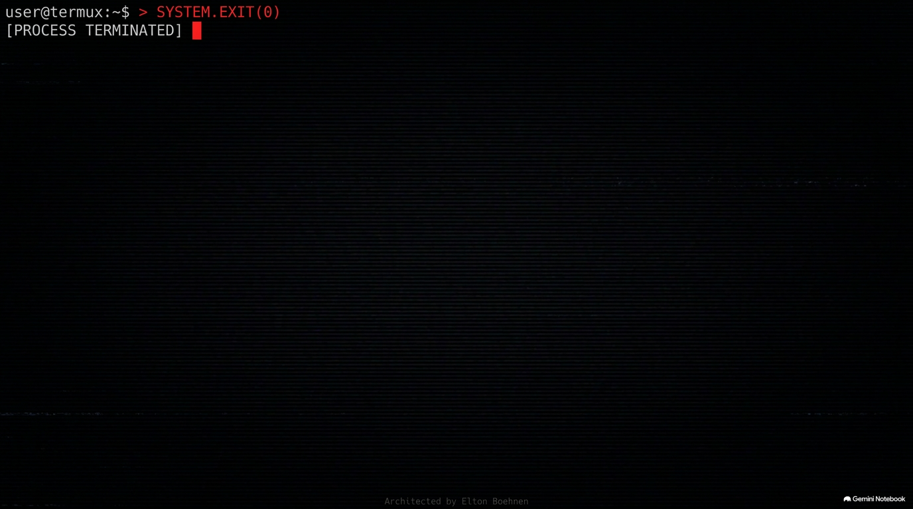

---

**Elton Boehnen**

[boehnenelton2024@gmail.com](mailto:boehnenelton2024@gmail.com) · [boehnenelton2024.pages.dev](https://boehnenelton2024.pages.dev) · [github.com/boehnenelton](https://github.com/boehnenelton)

*NewAgent v3.20.2 · pkg074 · 2026-08-14 · Session c6ff8cb5-b62b-4992-be4b-e16384b31b19*

</div>
